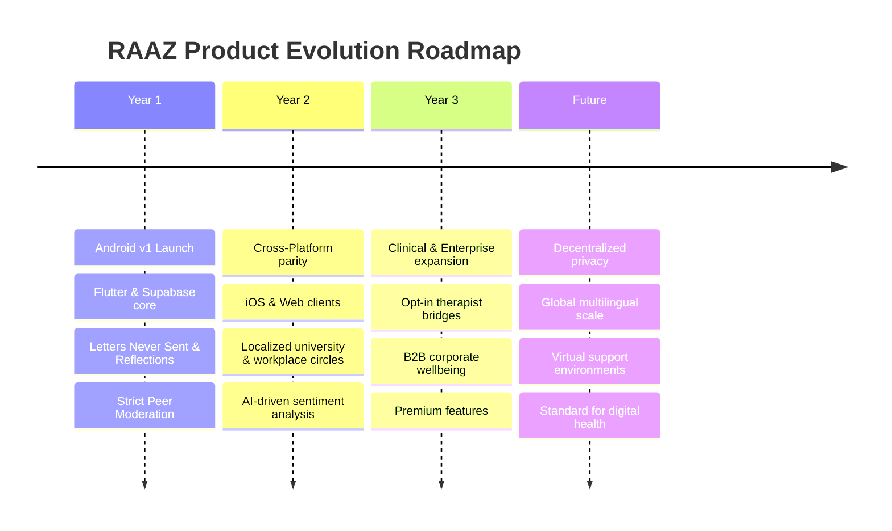

# ENTERPRISE PRODUCT REQUIREMENTS DOCUMENT (PRD)
## PHASE 1: PRODUCT FOUNDATION

**Product Name:** RAAZ  
**Company:** CloudExify  
**Product Type:** Anonymous Social Community Platform  
**Target Platform:** Android (Version 1)  
**Future Platforms:** iOS, Web  
**Backend Technology:** Supabase  
**Frontend Framework:** Flutter  
**Architecture Pattern:** Clean Architecture  
**State Management:** BLoC (Business Logic Component)  
**Document Version:** 1.0.0  
**Date:** July 14, 2026  

---

## 1. Executive Summary

### 1.1 Product Definition & Core Purpose
**RAAZ** (meaning *"Secret"* in Urdu/Hindi) is an enterprise-grade, anonymous social community platform designed to facilitate authentic human connection, vulnerable expression, and peer-to-peer emotional support. Unlike traditional social media networks that incentivize curated perfection, public status, and visual posturing, RAAZ provides a secure, identity-free environment where users can share their genuine feelings, struggles, confessions, and triumphs.

### 1.2 The Genesis: Why RAAZ Exists
Modern digital communication is fundamentally broken. Traditional platforms have commodified human interaction by creating digital feedback loops centered around public identity, likes, follower counts, and visual presentation. This has driven a global mental health crisis characterized by record-high levels of loneliness, anxiety, depression, and self-judgment. 

Users are forced to filter their lives to fit societal expectations. When they experience crises—such as career burnout, relationship failures, identity struggles, or parental anxiety—they lack a safe space to vent. Sharing these concerns on traditional social media threatens their professional reputations and personal relationships. Conversely, existing anonymous platforms often degenerate into toxic, unmoderated echo chambers.

RAAZ exists to fill this void. It is built on the belief that vulnerability is a strength, and that sharing secrets and seeking support anonymously can be a deeply therapeutic and community-building experience.

### 1.3 The RAAZ Solution & Value Proposition
RAAZ solves the conflict between expression and safety by separating the **voice** from the **identity**. It offers:
* **Zero identity linkage:** Other users cannot see real-world identifiers, profiles, search histories, or cross-post associations.
* **Toxicity-free environment:** Algorithmic safety nets combined with strict community-driven peer moderation isolate toxic behaviors.
* **Structured catharsis:** Dedicated features such as *Letters Never Sent* and *Daily Reflections* guide raw emotional venting into healthy, therapeutic expressions.
* **Constructive validation:** Positive support actions (e.g., "I feel you", "Sending strength") replace quantitative popularity metrics, shifting the focus from validation-seeking to community support.

### 1.4 Expected Long-Term Vision
The long-term vision for RAAZ is to become the global standard for anonymous community-driven mental wellness. We envision a platform that bridges the gap between peer-to-peer emotional validation and professional mental healthcare. RAAZ will evolve from an expression platform into a global ecosystem that includes localized support circles, enterprise workplace wellness programs, and opt-in bridges to licensed professional therapists—all while maintaining absolute user anonymity.

---

## 2. Product Vision

The RAAZ roadmap is designed to build a solid foundation of trust, scaling from a single mobile platform into a comprehensive cross-platform wellness ecosystem.



### 2.1 Year 1: Foundation, Safety, and Trust
* **Objective:** Establish the core RAAZ product on Android, prove the viability of the moderation model, and foster a highly engaged, high-empathy community.
* **Key Deliverables:** Launch the Android application built with Flutter (Clean Architecture + BLoC) and Supabase. Introduce core features: Anonymous Feed, *Letters Never Sent*, *Daily Reflections*, and Custom Support Reactions.
* **Success Indicator:** Achieve high organic retention and maintain a toxicity rate below 0.1% of all active posts.

### 2.2 Year 2: Ecosystem Expansion & Personalization
* **Objective:** Achieve cross-platform parity and scale the community horizontally and vertically.
* **Key Deliverables:** Launch iOS and Web platforms. Introduce localized sub-communities (e.g., University Circles, Industry-specific channels) allowing users to connect on shared contexts without exposing identities. Implement AI-driven moderation and sentiment mapping to predict and prevent harassment.
* **Success Indicator:** Maintain 99.9% feature parity across iOS and Android, with significant growth in daily active users.

### 2.3 Year 3: Monetization and Clinical Integration
* **Objective:** Establish sustainable revenue streams and transition from peer support to professional mental health integrations.
* **Key Deliverables:** Introduce *RAAZ Care*, an opt-in marketplace connecting users anonymously to licensed therapists. Launch B2B enterprise versions for companies seeking to provide anonymous mental health outlets for employees.
* **Success Indicator:** Successful onboarding of corporate clients and a self-sustaining revenue model through premium wellness services.

### 2.4 Future Expansion
* **Objective:** Pioneer decentralized, privacy-protecting communication standards.
* **Key Deliverables:** Transition the backend to a fully zero-knowledge architecture where even database administrators cannot reconstruct user behavior. Expand support environments to immersive spatial computing (VR/AR) for virtual therapy and support groups.

---

## 3. Mission Statement

> *"To empower individuals to express their authentic truths without fear of judgment, fostering a safe, private, and supportive global community that champions mental wellbeing, constructive peer connection, and absolute user privacy."*

### 3.1 Pillars of the Mission
* **Anonymous Expression:** Every human has a right to express their innermost thoughts without their words being permanently attached to their social or professional identity.
* **Mental Wellbeing:** We prioritize the emotional health of our users over screen time, click-through rates, or advertisement views.
* **Safe Community:** We believe a platform can be anonymous without being toxic. We enforce strict safety rules to protect vulnerable users.
* **Positive Interactions:** RAAZ is designed to incentivize empathy, active listening, and constructive support rather than debate, division, or judgment.
* **Trust & Privacy:** We treat privacy as a fundamental human right. Our architecture is designed to minimize data collection and secure what remains.

---

## 4. Problem Statement

### 4.1 The Problems Users Face on Traditional Social Media

Traditional social platforms are built on identity-centric frameworks. This design pattern has created several structural problems:

| Traditional Platform Problem | Psychological & Real-World Impact | How RAAZ Solves It |
| :--- | :--- | :--- |
| **Fear of Judgment & Social Consequences** | Users self-censor and post only hyper-curated, positive highlights of their lives to protect their reputation. | Absolute anonymity removes the connection to the physical user's identity, allowing raw, unfiltered truth. |
| **Privacy & Data Exploitation** | Tech conglomerates track personal browsing habits, location, and messages to sell targeted advertisements. | Zero-tracking policy. No social graph construction, no tracking cookies, and minimal telemetry. |
| **Toxic Comment Culture & Pile-ons** | Algorithms favor outrage, leading to cyberbullying, doxxing, and public shaming. | Peer-moderated queues, auto-flagging filters, and support-focused reaction sets prevent toxic loops. |
| **Status and Validation Anxiety** | "Like" counts and follower tracking create addictive cycles of insecurity and performative behaviors. | Custom support reactions (e.g., "I feel you") are focused on empathy, with public aggregate counters designed to show support rather than popularity. |
| **Mental Stress & Isolation** | Users feel isolated because they cannot share their actual struggles (career burnout, loneliness, relationship friction). | Structured features like *Daily Reflections* normalize shared human struggles, reducing isolation. |
| **Superficial Conversations** | Short-form media and status symbols reduce communication to shallow metrics and surface-level interactions. | Focus is placed entirely on text-based stories, reflections, and letters, encouraging deeper, reflective reading and writing. |

---

## 5. Product Goals

### 5.1 Short-Term Goals (0 - 6 Months)
* **Launch Android Version 1:** Deploy a production-ready, stable Android application built using Flutter and Supabase on the Google Play Store.
* **Architecture Integrity:** Maintain strict separation of concerns utilizing Clean Architecture and BLoC to ensure the codebase remains clean, testable, and maintainable.
* **Moderation Latency:** Keep average post-moderation and report-resolution latency under 5 minutes.
* **Initial Adoption:** Onboard 10,000 active users through organic channels and mental wellness communities.

### 5.2 Medium-Term Goals (6 - 18 Months)
* **iOS Platform Launch:** Deliver a high-performance iOS application utilizing the shared Flutter codebase.
* **User Engagement & Retention:** Achieve a Day-30 retention rate of 25% or higher.
* **Realtime Sync Performance:** Optimize Supabase realtime listeners to deliver message feeds and comment updates in under 200ms globally.
* **App Quality:** Maintain a Play Store rating of 4.5 stars or higher and a crash-free session rate of 99.9%.

### 5.3 Long-Term Goals (18 - 36 Months)
* **Web Client Deployment:** Launch a responsive, secure web platform to expand accessibility.
* **Global Community Scale:** Grow the user base to over 1,000,000 monthly active users (MAU).
* **Self-Sustaining Moderation:** Transition to a fully decentralized community moderation system run by trusted, high-reputation users.

### 5.4 Business Goals
* **Establish Trust Leadership:** Position CloudExify as the leading brand in ethical, privacy-focused application development.
* **Zero-Data Monetization:** Prove that a social platform can achieve financial sustainability without selling user data or using behavioral advertising.
* **Low Customer Acquisition Cost (CAC):** Rely on word-of-mouth, organic search, and community partnerships to keep CAC under $0.50.

### 5.5 Technical Goals
* **Stateless Client Architecture:** Store no personally identifiable information (PII) on the local device or in plaintext databases.
* **Sub-Second Core Actions:** Ensure that writing a post, reacting, or adding a comment takes less than 300ms from user action to database confirmation.
* **Auto-Scaling Infrastructure:** Set up automated Supabase resource scaling to handle sudden viral traffic spikes without service degradation.

### 5.6 Community Goals
* **High Empathy Quotient (EQ):** Ensure that over 80% of comments on posts expressing distress are classified as supportive or neutral.
* **Low Flag Rate:** Maintain flagged, toxic, or abusive content at less than 0.5% of total platform volume.
* **Diverse Representation:** Build a user base that represents a balanced distribution of age, gender, and regional backgrounds.

---

## 6. Target Audience

RAAZ is designed for individuals seeking authentic expression and support without the pressures of identity-driven social media.

```
                  RAAZ TARGET AUDIENCE SEGMENTS
                  
     [DEMOGRAPHICS]                     [PSYCHOGRAPHICS]
     ┌──────────────────────┐           ┌──────────────────────┐
     │ • Gen Z (16-24)      │           │ • Seek Advice/Support│
     │ • Millennials (25-40)│           │ • Burnout/Stress     │
     │ • English Speakers   │           │ • Anonymous Writers  │
     └──────────┬───────────┘           └──────────┬───────────┘
                │                                  │
                └─────────────────┬────────────────┘
                                  ▼
                        [CORE USER GROUPS]
     ┌─────────────────────────────────────────────────────────┐
     │ • Students (Academic stress, relationship issues)       │
     │ • Professionals (Burnout, imposter syndrome)           │
     │ • Parents (Parental guilt, postpartum isolation)       │
     │ • Mental Wellness Circles (Peer-led support seekers)    │
     └─────────────────────────────────────────────────────────┘
```

### 6.1 Age Groups & Demographics
* **Primary (18–24 years - Gen Z):** Digital natives seeking authentic spaces free from academic pressure, body image issues, and peer judgment.
* **Secondary (25–40 years - Millennials):** Career professionals, young parents, and individuals navigating major life transitions who need a space to process burnout and complex relationships.
* **Tertiary (16–17 years - Teenagers):** High school students needing a safe space to discuss identity, family struggles, and social anxieties under strict safety protocols.

### 6.2 Regions & Languages
* **Version 1 Focus:** English-speaking regions (North America, United Kingdom, Australia, India, and Western Europe).
* **Localization Roadmap:** Expansion to Spanish, Hindi, German, and Portuguese within 12 months.

### 6.3 Student Segment
* **Context:** High-pressure academic environments, university dorm life, and financial anxieties.
* **Behavior:** Need to express fears of academic failure, imposter syndrome, and social exclusion without affecting their academic standing or friendships.

### 6.4 Professional Segment
* **Context:** High-stress corporate jobs, entrepreneurship, and workplace politics.
* **Behavior:** Want to share workplace struggles, toxic management experiences, career doubts, and burnout symptoms without endangering their professional networks on LinkedIn or corporate profiles.

### 6.5 Parent Segment
* **Context:** Young parents, single parents, and those dealing with postnatal adjustments.
* **Behavior:** Seek a judgment-free space to discuss parental guilt, relationship strains after childbirth, and feelings of isolation that are taboo in physical social circles.

### 6.6 Anonymous Writers & Diary Keepers
* **Context:** Creative writers, journalists, poets, and individuals who keep private journals.
* **Behavior:** Wish to share prose, poetry, and raw thoughts with an audience to observe emotional resonance without linking the writing to a personal portfolio.

### 6.7 Mental Wellness Communities & Peer Seekers
* **Context:** Individuals managing mild-to-moderate mental health conditions (anxiety, depression, grief).
* **Behavior:** Actively seek peer-led support groups to read about others with similar struggles, finding comfort in shared experiences and offering mutual validation.

---

## 7. User Personas

To guide engineering and product design, the following three personas represent the core user segments of RAAZ.

### 7.1 Persona 1: Sarah — The Anxious Student

```
+-----------------------------------------------------------------+
| SARAH (21) | University Student | Tech Level: Advanced          |
+-----------------------------------------------------------------+
| GOALS:                                                          |
|  - Express feelings of imposter syndrome & academic anxiety.   |
|  - Find peer support from other students without judgment.      |
|  - Read shared experiences to normalize her own struggles.      |
|                                                                 |
| PAIN POINTS:                                                    |
|  - Fear of classmates finding out about her mental health struggles. |
|  - Instagram/TikTok feel superficial and increase her anxiety.   |
|  - Traditional forums (Reddit) feel too aggressive or technical. |
|                                                                 |
| USAGE SCENARIO:                                                 |
|  Writes a "Daily Reflection" response at 2 AM after studying    |
|  for exams, sharing her fear of failing her major.              |
+-----------------------------------------------------------------+
```

* **Expected Benefits:** 
  - Reduced sense of isolation.
  - Safe, constructive feedback from other students.
  - Emotional release that improves sleep hygiene and focus.

---

### 7.2 Persona 2: Marcus — The Burned-Out Engineer

```
+-----------------------------------------------------------------+
| MARCUS (34) | Senior Software Engineer | Tech Level: Expert     |
+-----------------------------------------------------------------+
| GOALS:                                                          |
|  - Vent about corporate burnout and management conflicts safely.|
|  - Share marital adjustments after having their first child.     |
|  - Provide advice to younger professionals facing similar stress.|
|                                                                 |
| PAIN POINTS:                                                    |
|  - Cannot post struggles on LinkedIn due to career risk.        |
|  - Cannot discuss burnout with peers who view it as weakness.  |
|  - Concerned about telemetry, data tracking, and doxxing.       |
|                                                                 |
| USAGE SCENARIO:                                                 |
|  Uses "Letters Never Sent" to write an unmailed message to his  |
|  manager during a lunch break, releasing frustration safely.   |
+-----------------------------------------------------------------+
```

* **Expected Benefits:**
  - Preventative mental health management before reaching clinical burnout.
  - Identification of coping strategies through peer interaction.
  - Complete assurance of data privacy and zero tracking.

---

### 7.3 Persona 3: Elena — The Isolated Mother

```
+-----------------------------------------------------------------+
| ELENA (29) | Stay-at-Home Mother | Tech Level: Intermediate    |
+-----------------------------------------------------------------+
| GOALS:                                                          |
|  - Find a community of mothers who share raw parenting truths.  |
|  - Share struggles with postpartum depression and loneliness.   |
|  - Receive validation that she is not failing as a parent.      |
|                                                                 |
| PAIN POINTS:                                                    |
|  - Facebook parenting groups are highly judgmental and toxic.   |
|  - Sharing parenting struggles publicly leads to family drama.   |
|  - Limited physical social contact due to child care duties.     |
|                                                                 |
| USAGE SCENARIO:                                                 |
|  Posts a confession on RAAZ about feeling overwhelmed and wanting |
|  time away from her infant, seeking empathetic validation.      |
+-----------------------------------------------------------------+
```

* **Expected Benefits:**
  - Access to a safe parenting community without competitive posturing.
  - Direct peer validation that reduces parental anxiety.
  - Micro-moments of connection throughout her domestic routine.

---

## 8. Unique Selling Proposition (USP)

RAAZ occupies a distinct position in the social and wellness application market. It provides a unique balance of anonymity, safety, and emotional support, differentiating itself from traditional networks, open forums, and existing anonymous apps.

### 8.1 Market Positioning Matrix

| Feature / Attribute | RAAZ | Traditional Social (IG, FB, LinkedIn) | Open Forums (Reddit) | Legacy Anonymous (Whisper, JikJak) |
| :--- | :--- | :--- | :--- | :--- |
| **Identity Requirement** | **None** (Dynamic Pseudonyms) | Real Name / Curated Profile | Persistent Username | None |
| **Privacy Standards** | **Zero-Tracking / Cryptographic** | Low (Targeted Ads) | Medium (Telemetry) | Low (Data Selling) |
| **Community Safety** | **Strict Empathy Moderation** | Medium (Reactive) | Low (Subreddit variance)| Very Low (Toxicity) |
| **Core Intent** | **Vulnerability & Peer Support**| Performative / Ad Sales | Topic Discussion | Entertainment / Chaos |
| **Mental Wellness Tools**| **Daily Reflections & Letters**| None | None | None |
| **Interaction Metrics** | **Support Reactions Only** | Quantitative Likes/Followers | Upvotes/Downvotes | Likes/Shares |

### 8.2 The Pillars of the RAAZ USP

* **Absolute, Frictionless Anonymity:** Users do not create persistent, searchable profiles. Posts are displayed with dynamic, system-generated pseudonyms (e.g., *Quiet River*, *Wandering Star*) that rotate per post, preventing the construction of an online persona or history trackable by other users.
* **"Letters Never Sent" Engine:** A dedicated emotional tool designed specifically for catharsis. Users write to individuals in their lives—past partners, estranged family, deceased loved ones—to express thoughts they cannot say in person. The community can offer silent support, providing a shared space for processing unexpressed emotions.
* **Guided Daily Reflections:** Instead of open-ended feeds that encourage sensationalism, RAAZ features daily prompts that encourage users to pause, reflect, and share authentic thoughts. This transforms the scrolling habit into a grounding exercise.
* **Empathy-Incentivized Feedback Loop:** There are no downvotes, negative comments, or competitive rankings. Reactions are explicitly designed to express empathy and support (e.g., *I hear you*, *Sending strength*, *You are not alone*), framing the app as a safe space for vulnerable sharing.

---

## 9. Product Scope (Version 1 - Android)

Version 1 is focused on building a stable, high-performance, and safe Android application. It establishes the core functional loop of anonymous post creation, positive engagement, and strict moderation.

```
                              RAAZ VERSION 1 SCOPE
 ┌────────────────────────────────────────┐ ┌──────────────────────────────────────┐
 │          INCLUDED IN VERSION 1         │ │       NOT INCLUDED IN VERSION 1      │
 ├────────────────────────────────────────┤ ├──────────────────────────────────────┤
 │ • Anonymous Authentication (Supabase)  │ │ • Direct Messaging (DMs)             │
 │ • The Main Feed (Dynamic Pseudonyms)   │ │ • Public Searchable Profiles         │
 │ • Letters Never Sent Module            │ │ • Image/Video/Audio Uploads          │
 │ • Daily Reflections Prompt Response    │ │ • Search by Username                 │
 │ • Custom Empathy Reactions             │ │ • Group Chat Rooms / Spaces          │
 │ • Text-Only Moderated Comments         │ │ • Web & iOS Clients                  │
 │ • Automated Safety Keyword Filters     │ │ • Monetization & Premium Tiers       │
 └────────────────────────────────────────┘ └──────────────────────────────────────┘
```

### 9.1 Core Functional Modules Included in V1

#### 9.1.1 Anonymous & Secure Onboarding
* **Mechanic:** Secure anonymous account creation utilizing Supabase Auth.
* **Security:** Generate a cryptographic token stored in the Android Secure Keystore.
* **Privacy:** No phone number, email address, or social login is required or stored for standard access. An optional recovery key system allows users to recover accounts without disclosing their identity.

#### 9.1.2 The Anonymized Feed
* **Mechanic:** A clean, chronologically organized feed displaying text-only posts.
* **Pseudonyms:** Every post is automatically assigned a random, system-generated combination of an adjective and a noun (e.g., *Calm Explorer*, *Luminous Wave*). The pseudonym is ephemeral and resets with each new post, preventing post history tracking.

#### 9.1.3 Letters Never Sent
* **Mechanic:** A dedicated section of the application where users compose letters to specific recipients (e.g., "To my past self," "To the stranger on the train").
* **Layout:** Visually styled as an envelope or typed page. Users can share these letters to the public feed or archive them in their local vault for private catharsis.

#### 9.1.4 Daily Reflections
* **Mechanic:** A single prompt is delivered to all users daily at 6:00 AM local time.
* **Prompts:** Curated by wellness advisors (e.g., *"What is something you are holding onto that you need to let go of?"*).
* **Feed:** A dedicated tab allows users to read and react to reflections submitted by the community on that day.

#### 9.1.5 Empathy Reactions & Moderated Comments
* **Reactions:** Users can react using five predefined empathy tags: *I Hear You*, *Sending Strength*, *Been There*, *Thank You*, and *Calming Hug*.
* **Comments:** Text-only, character-limited comments (maximum 500 characters). Comments pass through an automated blocklist filter and require peer approval if flagged.

#### 9.1.6 Safety & Reporting Utilities
* **Reporting:** Single-tap report button on every post and comment.
* **Options:** Clear reporting reasons: *Self-harm risk*, *Harassment*, *Hate speech*, *Personally identifiable information (PII) leak*, and *Spam*.
* **Automated Moderation:** Instant automated removal of posts containing words from a pre-configured blocklist database.

---

## 10. Future Vision (Version 2, Version 3, and Beyond)

The future roadmap scales RAAZ into a multi-platform, AI-supported wellness network that provides both peer-to-peer and professional support.

### 10.1 Version 2: Cross-Platform Parity & Structural Refinement
* **iOS Application:** Launch the iOS version using the shared Flutter codebase, ensuring full feature parity with the Android build.
* **Localized Sub-Feeds:** Introduce interest-based channels (e.g., *Career Burnout*, *Grief Support*, *Parenting Struggles*) and geographic circles (e.g., *University Campus Circles*) to help users connect around shared contexts.
* **AI-Assisted Moderation:** Implement natural language processing (NLP) models to detect harassment, bullying, and self-harm indicators before posts go live.
* **Direct Crisis Intervention:** Partner with established crisis text lines and mental health organizations to trigger helpful resources dynamically when self-harm indicators are detected.

### 10.2 Version 3: Monetization, Web Platform & Clinical Bridges
* **Web Client Launch:** Release a secure, responsive web application designed for reading, writing, and community engagement.
* **RAAZ Premium Tiers:**
  * **Audio Vault:** Secure, encrypted, voice-changing audio diaries for private reflection.
  * **Custom Focus Rooms:** Private, themed group discussion spaces with limited participant counts.
  * **Ad-Free Zen Mode:** An optimized user interface designed to minimize distractions and promote calm.
* **The Therapist Bridge (*RAAZ Care*):** An opt-in marketplace where users can connect anonymously with certified wellness coaches or licensed therapists for virtual sessions, with payment processed securely without compromising the user's platform anonymity.
* **B2B Enterprise Moderation:** White-labeled, anonymous internal forums for enterprises looking to support employee mental health and gather candid organizational feedback safely.

---

## 11. Success Metrics

To monitor product health, user satisfaction, and system stability, CloudExify will track metrics across three key dimensions.

```
┌────────────────────────────────────────────────────────────────────────┐
│                          RAAZ KEY METRICS                              │
├─────────────────────────┬──────────────────────┬───────────────────────┤
│    ENGAGEMENT KPIs      │     SAFETY METRICS   │   TECHNICAL METRICS   │
├─────────────────────────┼──────────────────────┼───────────────────────┤
│ • DAU / MAU Ratio (>35%)│ • False Neg. (<0.01%)│ • Startup Time (<2.5s)│
│ • D1 / D7 / D30 Ret.    │ • Report Resolution  │ • Crash-free (>99.9%) │
│ • Support Actions Ratio │ • Toxic Content Vol. │ • API Latency (<200ms)│
└─────────────────────────┴──────────────────────┴───────────────────────┘
```

### 11.1 Engagement and Adoption KPIs
* **Daily Active Users / Monthly Active Users (DAU/MAU):** Target a ratio of **>35%** to verify the platform is forming consistent user habits.
* **User Retention:** Target Cohort Retention rates of:
  * **Day 1:** >45%
  * **Day 7:** >25%
  * **Day 30:** >15%
* **Support Actions Ratio:** The volume of empathy reactions compared to total posts. Target a ratio of **>4:1**, showing that the average post receives multiple supportive responses.
* **Organic User Growth Rate:** Month-on-month active user growth. Target **15%** growth in the first six months.

### 11.2 Community Safety & Moderation Metrics
* **Toxicity Incidence Rate:** The percentage of posts containing hostile content that are visible to users. Target **<0.1%** of all displayed posts.
* **Report Resolution Time:** The time from a user submitting a report to action being taken. Target an average of **<5 minutes** for self-harm and harassment reports.
* **False Negative Rate:** Missed toxic posts that are not flagged by filters or reported within 1 hour. Target **<0.01%** of total posts.

### 11.3 Technical Quality & Performance KPIs
* **Application Startup Time:** Time to interactive state (TTI) on a standard mid-range Android device. Target **<2.5 seconds**.
* **Crash-Free Session Rate:** The percentage of user sessions that do not experience an application crash. Target **>99.9%**.
* **API Response Latency:** Latency for core endpoints (retrieve feed, submit post). Target **<200ms** at the 95th percentile.
* **Play Store Rating:** Target and maintain a user review rating of **>4.5 stars**.

---

## 12. Business Objectives

CloudExify's objectives focus on establishing user trust, growing a safe community, and preparing for sustainable monetization that respects user privacy.

### 12.1 Brand Growth & Positioning
* **Ethical Tech Positioning:** Establish CloudExify as an industry leader in ethical software development, privacy engineering, and digital wellness design.
* **Strategic Partnerships:** Form alliances with at least three mental health foundations, crisis text lines, or wellness organizations by the end of Year 1.

### 12.2 Community Growth & Geographic Footprint
* **Early Adopter Base:** Build an active, supportive core community in major university hubs, creating a strong foundation of high-empathy interactions.
* **Low-Cost Acquisition:** Maintain a viral coefficient (K-factor) of **>1.1** via anonymous sharing options (allowing users to share visually styled posts to external networks while preserving their identity), keeping acquisition costs low.

### 12.3 Establishing & Maintaining User Trust
* **Privacy Audits:** Commit to annual independent privacy audits and publish transparency reports detailing government requests (and the company's inability to provide user data due to our architecture).
* **Data Privacy Policies:** Implement user data agreements that guarantee user data will never be sold, leased, or analyzed for commercial marketing.

### 12.4 Sustainable Monetization Strategy
* **Ad-Free Tier:** A premium subscription tier that removes basic promotional banners and provides custom layouts.
* **Wellness Marketplace (*RAAZ Care*):** Commission fee model on secure, anonymous booking of virtual therapy sessions, generating revenue while supporting mental health professionals.
* **B2B Organizational Licenses:** Enterprise packages for corporations, providing white-labeled anonymous wellness feedback boards to improve employee engagement and retention.

---

## 13. Product Principles

These nine core principles guide every design, architectural, and business decision at RAAZ.

### 13.1 Privacy First
Privacy is a core feature, not an afterthought. We do not track user IP addresses, location details, device serial numbers, or browsing histories. Metadata is sanitized, database connections are encrypted, and local caches are cleared upon session close.

### 13.2 Anonymous First
User identity is decoupled from content. There are no usernames, profile pictures, biographical descriptions, or public post histories visible to the community. Users can express themselves without worrying about building a persistent digital footprint.

### 13.3 Community First
Safety, empathy, and constructive peer connection are prioritized over engagement metrics. We do not use algorithms designed to trigger outrage or anxiety to keep users online. If an engagement mechanic compromises safety, we will change it.

### 13.4 Simple & Calming UX
The user interface is designed to reduce stress. It features dark-mode layouts by default, clean typography, minimal icons, and calming micro-interactions. The user interface avoids red notification dots and loud banners to reduce screen anxiety.

### 13.5 High Performance
The application is optimized for mid-range and low-end Android devices. Animations must target a smooth 60 FPS, memory usage must be minimized, and network payloads must be compressed to accommodate limited data connections.

### 13.6 Accessibility
RAAZ is designed for all users. The application adheres strictly to WCAG 2.1 Level AA accessibility standards, including support for screen readers, high-contrast layouts, dynamic text sizing, and voice-assisted post composition.

### 13.7 Mutual Trust
We trust our community to help moderate and guide the platform, and the community trusts us to secure their data. We maintain this trust through absolute transparency, open-source security reviews, and clear community rules.

### 13.8 Empathy and Respect
The platform encourages respectful communication. Features are designed to promote reflection, active listening, and constructive support, rejecting hostile debate and personal attacks.

### 13.9 Secure Architecture
We secure user data through modern encryption standards, secure token storage, and protected API endpoints. We design our architecture to prevent data leaks, unauthorized access, and deanonymization attacks.

---

## 14. Assumptions

### 14.1 User Behavior Assumptions
* **Desire for Anonymity:** There is a significant user base that wants to share struggles and thoughts anonymously without the burden of maintaining a public social media persona.
* **Empathetic Participation:** Given the right tools, interface cues, and moderation, an anonymous community can remain supportive and avoid toxicity.
* **Wellness Value:** Users find emotional release, stress relief, and validation in structured writing exercises like *Letters Never Sent* and *Daily Reflections*.

### 14.2 Technical & Architectural Assumptions
* **Flutter & Supabase Scalability:** Flutter Clean Architecture combined with BLoC and Supabase is scalable and robust enough to support rapid growth and high concurrent user volume.
* **Google Play Policy Compliance:** The Google Play Store will approve an anonymous community application provided it includes robust user-generated content (UGC) moderation tools, reporting options, and content filtering.
* **Effective Network Security:** Secure HTTPS connections and standard cryptographic key storage in Android's Keystore are sufficient to protect users from localized intercepts and data leaks.

---

## 15. Constraints

### 15.1 Technical Constraints
* **Supabase Free-Tier Limits:** Initial development must operate within Supabase's resource limits (e.g., 500MB database, 50,000 monthly active users) until funding is secured.
* **Android OS Compatibility:** The application must support Android SDK version 21 (Android 5.0) and higher, limiting the use of newer APIs.
* **Offline Syncing:** Supabase requires active network connections for realtime listeners. Offline functionality will be limited to reading cached feeds and saving drafts locally in the secure cache.

### 15.2 Business & Financial Constraints
* **Bootstrapped Budget:** CloudExify is bootstrapping the initial launch, limiting advertising spend and requiring focus on organic growth channels.
* **Small Development Team:** The initial engineering and product team is small, requiring strict scope management to avoid delays.

### 15.3 Platform & Compliance Constraints
* **Google Play UGC Policy:** Google Play Store's developer policies require immediate, reliable moderation tools for apps containing user-generated content, necessitating robust flagging and reporting features at launch.
* **COPPA & Age Verification:** The application must comply with child privacy laws (COPPA, GDPR-K), restricting access to users aged 16 and older and requiring age-verification gates during onboarding.

### 15.4 Privacy Constraints
* **No Third-Party Analytics:** We cannot use traditional analytics tools (e.g., Firebase Analytics, Google Analytics) that collect advertising IDs, IP addresses, or device identifiers. Telemetry must be collected using custom, self-hosted, privacy-preserving tools.

---

## 16. Risks and Mitigations

| Risk Area | Specific Risk | Impact | Mitigation Strategy |
| :--- | :--- | :--- | :--- |
| **Business / Legal** | Legal liability for self-harm or illegal activities discussed on the platform. | High | Implement automated detection for key risk words, showing immediate crisis helpline links and escalating reports to the moderation queue. |
| **Moderation** | Platform becomes toxic, driving away users and violating store policies. | Critical | Apply automated keyword filters, a simple reporting flow, and peer-moderated queues to isolate toxic content. |
| **Technical** | Database scaling bottlenecks during sudden traffic spikes. | Medium | Optimize database queries and indexing in Supabase; implement database caching and prepare auto-scaling configurations. |
| **Security** | Malicious users attempt to deanonymize others via metadata or cross-post analysis. | High | Remove metadata from posts, rotate pseudonyms per post, and prevent tracking of user IP addresses in database logs. |
| **Google Play Store** | App suspension due to policy violations regarding anonymous UGC. | Critical | Implement reporting buttons, blocklists, and immediate post-removal capabilities to comply with Play Store safety requirements. |
| **Community Growth** | Platform struggles to gain initial adoption without traditional viral hooks. | Medium | Add anonymous sharing features, allowing users to export styled posts to other networks while preserving their identity, driving organic traffic. |

---

## 17. Out of Scope (For Version 1)

To prevent scope creep and ensure a timely, stable launch on Android, the following features are excluded from Version 1:

* **Direct Messaging (DMs):** Private chat between users is excluded to prevent harassment, solicitation, and the need for complex moderation of private communications.
* **Media Uploads:** Users cannot upload images, videos, or audio files. This reduces hosting costs, prevents copyright issues, and simplifies moderation of explicit content.
* **User Profiles:** No public profiles, bio sections, or lists showing a user's post history are included, ensuring complete user anonymity.
* **Search by Username:** Username-based search is excluded, preventing users from tracking individual accounts.
* **iOS & Web Clients:** Version 1 focuses exclusively on Android; other platforms will be introduced in future updates.
* **Monetization:** Payment systems, advertisements, and premium subscriptions are excluded from the initial release.
* **Geographic Tracking:** The app will not access or use GPS coordinates, protecting user location privacy.
