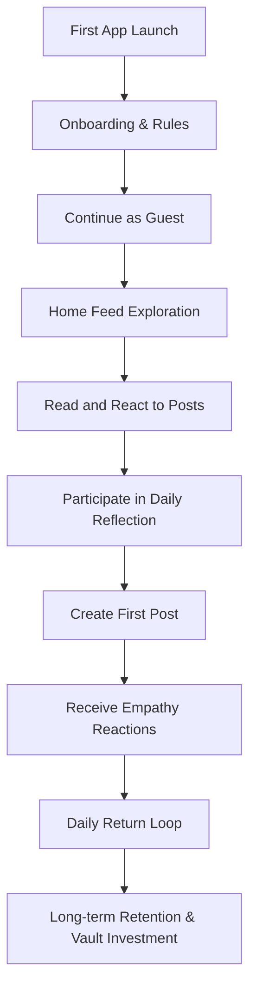

# ENTERPRISE PRODUCT REQUIREMENTS DOCUMENT (PRD)
## PHASE 2: USER EXPERIENCE AND USER FLOWS

**Product Name:** RAAZ  
**Company:** CloudExify  
**Target Platform:** Android (Version 1)  
**Backend:** Supabase  
**Frontend:** Flutter  
**State Management:** BLoC  
**Document Version:** 2.0.0  
**Date:** July 14, 2026  

---

## 1. Complete User Journey

The RAAZ user lifecycle is designed to guide users from initial curiosity to active community participation and long-term retention.



### 1.1 First App Launch
* **Normal Flow:**
  1. The user downloads and launches RAAZ on Android.
  2. The application displays a animated brand splash screen while initializing local settings and checking for network connectivity.
  3. The system checks the local Android Secure Keystore. If no cryptographic token exists, the application generates a guest token in the background and navigates to the Onboarding carousel.
* **Exception Flow - Initial Launch Network Failure:**
  1. If network connectivity is unavailable, the application halts splash navigation and presents a full-screen offline recovery screen.
  2. The user is presented with a "Retry Connection" action. Upon network recovery, onboarding proceeds automatically.

### 1.2 Onboarding
* **Normal Flow:**
  1. The onboarding sequence consists of three cards highlighting the platform's core values: Anonymity, Safety/Empathy, and Structured Expression (*Letters Never Sent*, *Daily Reflections*).
  2. The final onboarding card presents the Community Agreement ("Rules of RAAZ") outlining strict policies against hate speech, self-harm details, harassment, and sharing personally identifiable information (PII).
  3. The user must tap "Agree & Enter" to proceed.
* **Alternative Flow - Skips Onboarding:**
  1. If a returning guest installs the application and has an exported cryptographic recovery key, they can tap "Import Key" on the initial screen to bypass onboarding and restore their account.

### 1.3 Continue as Guest
* **Normal Flow:**
  1. Upon agreeing to the Community Agreement, the system creates a guest account using Supabase Auth.
  2. A local profile is established in the client database containing preferences, bookmarks, and draft collections.
  3. The user is navigated directly to the Home Feed. No email, password, phone number, or social credentials are requested.

### 1.4 Home Feed Exploration & Reading Posts
* **Normal Flow:**
  1. The feed displays a chronological list of text-only posts under temporary, system-generated pseudonyms.
  2. The user scrolls through the feed. Cards contain the pseudonym, post timestamp, text snippet, category tags, mood indicators, and the count of support reactions.
  3. Tapping a card opens the Post Details screen, loading the full text and comments.

### 1.5 Creating First Post
* **Normal Flow:**
  1. The user taps the Floating Action Button (FAB) on the Home Feed.
  2. The user writes a post, selects a category (e.g., *Career*, *Relationships*), chooses a mood tag, and selects a template for writing inspiration.
  3. Tapping "Publish" uploads the post to Supabase, making it visible to the community under a new dynamic pseudonym.

### 1.6 Receiving Community Support
* **Normal Flow:**
  1. Other users read the post and react using empathy tags (e.g., *I Hear You*, *Sending Strength*).
  2. The author receives a push notification: *"Someone feels your words."*
  3. Tapping the notification opens the post, displaying the updated support reactions.

### 1.7 Returning Daily & Long-term Retention
* **Normal Flow:**
  1. The user is prompted daily by a *Daily Reflection* or *Daily Challenge* notification.
  2. The user participates, writes responses, reads shared community experiences, and bookmarks meaningful posts.
  3. Over time, the user builds a personal vault of bookmarks, reflections, and private letters, establishing a long-term retention loop.

---

## 2. Navigation Flow

RAAZ utilizes a structured, predictable navigation framework designed to minimize user friction and cognitive load.

### 2.1 Navigation Structure Diagram

```
                              [SEARCH ICON] (Top Right)
                                     │
                             ┌───────▼───────┐
                             │ Search Screen │
                             └───────────────┘
                                     ▲
                                     │ (Taps search result)
┌────────────────────────────────────┴────────────────────────────────────┐
│                              TOP APP BAR                                │
│ [App Title / Logo]                     [BOOKMARK VAULT ICON] (Top Right)│
└────────────────────────────────────┬────────────────────────────────────┘
                                     │
                             ┌───────▼───────┐
                             │ Bookmark Vault│
                             └───────────────┘
                                     ▲
                                     │ (From any feed card)
┌────────────────────────────────────┴────────────────────────────────────┐
│                           BOTTOM NAVIGATION                             │
│ ┌───────────────┐ ┌───────────────┐ ┌───────────────┐ ┌───────────────┐ │
│ │   Home Feed   │ │ Reflections   │ │ Letters Vault │ │   Settings    │ │
│ └───────┬───────┘ └───────┬───────┘ └───────┬───────┘ └───────┬───────┘ │
└─────────┼─────────────────┼─────────────────┼─────────────────┼─────────┘
          │                 │                 │                 │
          ▼                 ▼                 ▼                 ▼
   [Post Detail]     [Reflection Details]  [Write Letter]   [Settings Panel]
          │                 │                 │                 │
          └─────────────────┴────────┬────────┴─────────────────┘
                                     │ (Back Navigation)
                                     ▼
                              [Previous Screen]
```

### 2.2 Navigation Components & Interaction Rules

#### 2.2.1 Bottom Navigation Bar
* **Tabs:**
  1. **Home Feed:** Displays community stories, categorized tabs, and filters.
  2. **Daily Reflections:** Guided daily emotional prompts and unlocked community responses.
  3. **Letters Vault:** Contains the *Letters Never Sent* interface, drafts, and archives.
  4. **Settings:** Profile recovery tools, theme selection, caching preferences, and support links.
* **Floating Action Button (FAB):** Positioned centrally above the bottom navigation bar, launching the **Create Post** screen.

#### 2.2.2 Top App Bar (Stateful)
* **Home Feed Screen Top Bar:** Displays the RAAZ wordmark, the **Search** icon (right), and the **Bookmark Vault** icon (far right).
* **Create/Details Top Bar:** Displays a back navigation arrow, the screen title, and a context action (e.g., *Publish*, *Delete*, *Edit*).

#### 2.2.3 Bottom Sheets
* **Filter/Sort Sheet:** Slides up from the bottom when tapping filter headers, presenting sorting metrics (e.g., *Recent*, *Trending*) and mood category check lists.
* **Share/Export Sheet:** Triggered by tapping the Share button. Presents options to copy the post link, copy the text body, or export a styled image card.
* **Report Content Sheet:** Triggered by tapping the flag icon. Displays reporting category options.

#### 2.2.4 Back Navigation
* **Software/Hardware Back Keys:** Standard Android back navigation is supported.
* **Pop Confirmation:** If a user is on a writing screen (Create Post, Write Letter, Add Comment) with changes made, tapping Back triggers a dialog: *"Discard current draft?"*
* **App Exit:** Tapping Back on the Home Feed displays a brief exit message. A subsequent tap within 2 seconds exits the application.

#### 2.2.5 Deep Navigation & Entry/Exit Rules
* **Push Notifications:** Direct users to specific screens, bypassing standard navigation stacks. Tapping Back from a deep-linked screen returns the user to the Home Feed.

---

## 3. Guest User Flow

RAAZ operates on a guest-first access model to prioritize privacy and reduce user friction.

### 3.1 Flow Diagram: Guest Lifecycle & Key Management

```
[Agree to Terms] ──> [Generate Cryptographic Key Pair] ──> [Save Private Key in Android Keystore]
                                                                    │
   ┌────────────────────────────────────────────────────────────────┴──────────────────────────────┐
   ▼                                                                                               ▼
[Local Guest Mode] (Normal Usage)                                                     [Export Key Setup (Backup)]
   │ • Browse, Post, Comment, React                                                                │
   │                                                                                               ▼
   │ (Device Lost / App Uninstalled)                                                    [Generate Recovery QR & Text]
   ▼                                                                                               │
[Identity Lost] (No recovery key)                                                                  ▼
                                                                                      [Import Key on New Device]
                                                                                                   │
                                                                                                   ▼
                                                                                        [Restore Account Identity]
```

### 3.2 Detailed Flow Descriptions

#### 3.2.1 Platform Permissions & Restrictions

* **Permissions:**
  - Read posts, comments, reflections, and challenges.
  - Create posts, replies, letters, challenges, and bookmarks.
  - Submit reporting actions and react to community posts.
* **Restrictions:**
  - Cannot access the account from another device simultaneously (no multi-device sync in guest mode).
  - Account recovery is impossible if the app is uninstalled without exporting a recovery key.

#### 3.2.2 Anonymous Identity Generation
* **System Logic:**
  - During onboarding, the client application requests a secure key pair generation from Supabase.
  - The public key is stored on the Supabase authentication database linked to a random UID.
  - The private key is stored in the device's Android Secure Keystore.
  - A user's public identity is displayed using ephemeral pseudonyms that rotate with each post to prevent tracking.

#### 3.2.3 Future Upgrade/Backup Path
* **Normal Flow:**
  - Users can backup their identity by navigating to **Settings -> Account Security -> Backup Key**.
  - The app generates a password-protected JSON key file or a static QR code representing the encrypted private credentials.
  - To restore the account on a new device, the user taps "Import Backup Key" during onboarding, restores the private key, and recovers their post history.
* **Exception Flow - Lost Backup Key:**
  - If a user loses their backup key and uninstalls the app, CloudExify cannot recover their identity or posts.

---

## 4. Home Feed User Flow

The Home Feed is the primary destination for content discovery and community interaction.

### 4.1 Detailed Flow Descriptions

#### 4.1.1 Opening Feed
* **Normal Flow:**
  1. The user navigates to the Home Feed.
  2. The client fetches the first page of posts from Supabase.
  3. The local SQLite cache updates, and the feed displays the new posts.
* **Exception Flow - Load Failure:**
  1. If the database query fails or a connection timeout occurs, the UI displays a network error screen.
  2. Tapping "Retry" refreshes the connection.

#### 4.1.2 Refreshing Feed & Infinite Scroll
* **Normal Flow (Pull-to-Refresh):**
  1. The user pulls down from the top of the feed.
  2. A loading indicator appears, and a request is sent to Supabase for posts newer than the current top post.
  3. New posts are added to the top of the feed with a subtle transition, and the loading indicator disappears.
* **Normal Flow (Infinite Scroll):**
  1. As the user scrolls near the bottom of the feed (within 3 items of the end), the app requests the next page of posts (fetch size: 20).
  2. A progress indicator displays at the bottom of the feed during the request.
  3. Newly loaded posts are appended to the feed, and the loader is removed.
* **Exception Flow - End of Feed:**
  1. When no more posts are returned from the database, the bottom loading indicator is replaced with a message: *"You have caught up with the community."*

#### 4.1.3 Category & Mood Filtering
* **Normal Flow:**
  1. The user taps the filter button in the Top App Bar.
  2. The Filter bottom sheet opens, displaying available categories (e.g., *Grief*, *Relationships*, *Work*) and moods (e.g., *Hopeful*, *Overwhelmed*, *Lonely*).
  3. The user selects their desired options and taps "Apply Filters".
  4. The feed updates to show only matching posts.

#### 4.1.4 Reaction & Support Flow
* **Normal Flow:**
  1. The user taps the Support button on a feed card.
  2. An Empathy menu displays available tags: *I Hear You*, *Sending Strength*, *Been There*, *Thank You*, and *Calming Hug*.
  3. The user selects a reaction.
  4. The UI increments the reaction count immediately (optimistic UI rendering) while syncing the action with the Supabase database.
* **Alternative Flow - Toggling Reactions:**
  1. Tapping an active reaction removes it, decrementing the count and updating the database.

---

## 5. Create Post Flow

The Create Post flow encourages thoughtful writing while maintaining safety and moderation standards.

### 5.1 Detailed Flow Descriptions

#### 5.1.1 Entering Screen & Writing
* **Normal Flow:**
  1. The user taps the FAB on the Home Feed.
  2. The Create Post screen opens, focusing on the text area and launching the soft keyboard.
  3. A writing template card is displayed at the top for inspiration (e.g., *"What is on your mind that you cannot say out loud?"*).

#### 5.1.2 Post Validation Rules
* **Character Validation:**
  - Minimum character count: **100 characters**.
  - Maximum character count: **2,000 characters**.
  - The "Publish" button remains disabled until the character count meets the minimum requirement. An active character counter changes color if the limit is exceeded.
* **Content Filtering:**
  - Before submission, the text is scanned for forbidden keywords (e.g., explicit insults, phone numbers, addresses, self-harm instructions).
  - If a violation is flagged, the app displays a validation error, highlighting the problematic text.

#### 5.1.3 Category, Mood, and Template Selection
* **Normal Flow:**
  1. The user selects a category and a mood tag from horizontal scrolling lists.
  2. The user can optionally select a writing template to pre-fill prompts in the text area.
  3. The user taps "Publish".

#### 5.1.4 Draft Auto-Saving
* **Normal Flow:**
  1. If the user exits the screen before publishing, the draft is saved to the local SQLite database.
  2. Re-entering the Create Post screen prompts the user: *"Would you like to continue writing your draft?"*

#### 5.1.5 Publishing Execution & Error States
* **Normal Flow:**
  1. Tapping "Publish" triggers a loading indicator.
  2. The post is sent to Supabase and saved.
  3. The application displays a success animation and returns to the Home Feed.
* **Exception Flow - Database Timeout:**
  1. If the upload request takes longer than 10 seconds, the app displays a timeout error dialog.
  2. The draft is preserved, and the user is returned to the edit screen to try again.

---

## 6. Post Details Flow

The Post Details screen displays the full text of a post and its associated comments.

### 6.1 Detailed Flow Descriptions

#### 6.1.1 Opening Post
* **Normal Flow:**
  1. The user taps a post card on the feed.
  2. The Post Details screen transitions into view, displaying the post content, category tags, mood, and support reactions.
  3. Comments are fetched from the database and loaded below the post content.
* **Exception Flow - Post Deleted:**
  1. If the post was deleted by the author or removed by moderators before the user tapped it, the app displays an error dialog: *"This post is no longer available."*
  2. Tapping "OK" returns the user to the feed.

#### 6.1.2 Interactive Features
* **Normal Flow (React/Support):**
  - Users can apply or change empathy reactions.
* **Normal Flow (Bookmarking):**
  - Tapping the bookmark icon saves the post ID to local storage, displaying a success toast: *"Post saved to your vault."*
* **Normal Flow (Reporting):**
  - Tapping the flag icon opens the report menu. Selecting a reason submits the report, closes the screen, and returns the user to the feed.

---

## 7. Comments Flow

The Comments flow allows users to respond to posts while maintaining community safety and respect.

### 7.1 Detailed Flow Descriptions

#### 7.1.1 Adding a Comment
* **Normal Flow:**
  1. The user taps the comment input field at the bottom of the Post Details screen.
  2. The user types their comment and taps "Send".
  3. The comment text is scanned for spam and forbidden keywords.
  4. The comment is uploaded to Supabase, and the feed updates to display the comment.

#### 7.1.2 Comment Validation Rules
* **Character limits:** Minimum **10 characters**, maximum **500 characters**.
* **Forbidden links:** Web URLs (http/https) are blocked to prevent spam and identity exposure.
* **Profanity filter:** The app automatically flags comments containing keywords from the forbidden word list.

#### 7.1.3 Nested Replies & Deletion
* **Normal Flow (Reply):**
  1. Tapping "Reply" on a comment indents the input field, linking the response to that comment.
  2. The system allows one level of nesting to keep the interface clean.
* **Normal Flow (Delete):**
  1. Users can delete their own comments.
  2. Tapping "Delete" triggers a confirmation dialog. Upon confirmation, the comment is removed, and the UI displays: *"[This comment has been deleted by the author]"*.

---

## 8. Search Flow

The Search screen helps users find posts, categories, and tags matching their interests.

### 8.1 Detailed Flow Descriptions

#### 8.1.1 Opening Search & Suggestions
* **Normal Flow:**
  1. The user taps the Search icon in the Top App Bar.
  2. The Search screen displays the keyboard, showing recent searches and trending keywords.
  3. Typing in the search field displays real-time category suggestions.

#### 8.1.2 Search Execution
* **Normal Flow:**
  1. The user types a query and taps the search key.
  2. The query is matched against post text, categories, and tags.
  3. Results are displayed in a clean, scrollable list.
* **Exception Flow - No Results:**
  1. If no posts match the query, the app displays an empty search state: *"We couldn't find any posts matching your search."*
  2. The screen suggests related categories or active prompts to help the user find content.

---

## 9. Bookmark Flow

The Bookmark flow allows users to build a private library of meaningful posts and resources.

### 9.1 Detailed Flow Descriptions

#### 9.1.1 Bookmarking Content
* **Normal Flow:**
  1. The user taps the bookmark icon on a post.
  2. The icon updates immediately, and the post is saved to local storage.
  3. The app displays a toast confirmation: *"Saved to your vault."*

#### 9.1.2 Viewing the Bookmark Vault
* **Normal Flow:**
  1. The user taps the Bookmark Vault icon in the Top App Bar.
  2. The Bookmark Vault screen opens, displaying saved posts categorized by tags (e.g., *Supportive*, *Reflective*, *Inspirational*).
  3. Users can read, organize, or remove bookmarks from this screen.
* **Exception Flow - Storage Limit:**
  1. If local storage is full, the app displays an error message prompting the user to clear cached files or remove older bookmarks.

---

## 10. Daily Reflection Flow

Daily Reflections encourage mindful sharing through structured prompts.

### 10.1 Detailed Flow Descriptions

#### 10.1.1 Viewing Daily Reflections
* **Normal Flow:**
  1. The user receives a notification at 6:00 AM local time presenting the daily prompt.
  2. Tapping the notification opens the Daily Reflection screen.
  3. The prompt is displayed above a locked answers feed.
* **Active Engagement Loop:**
  - To view community responses, the user must first submit their own reflection.

#### 10.1.2 Submitting a Reflection
* **Normal Flow:**
  1. The user writes their response in the text field (minimum 50 characters).
  2. Tapping "Submit" uploads the response anonymously.
  3. The feed unlocks, displaying community answers for that day.
* **Alternative Flow - Skipping Posting:**
  - Users can read community responses without posting after 24 hours have passed since the prompt's release.

---

## 11. Daily Challenge Flow

Daily Challenges encourage positive participation through small, actionable goals.

### 11.1 Detailed Flow Descriptions

#### 11.1.1 Participating in Challenges
* **Normal Flow:**
  1. The user checks the "Daily Challenge" card on the Home Feed.
  2. The card displays today's challenge (e.g., *"Read three stories in the Grief category and leave supportive reactions"*).
  3. The app tracks the user's progress in the background.
  4. Completing the challenge displays a completion badge and adds a streak count to the user's local stats.

#### 11.1.2 Viewing Community Stats
* **Normal Flow:**
  1. Tapping the challenge card shows community participation stats (e.g., *"12,450 users completed today's challenge"*).
  2. No individual user progress is shared, protecting user anonymity.

---

## 12. Letters Never Sent Flow

This feature provides a safe outlet for expressing unmailed thoughts to others.

### 12.1 Detailed Flow Descriptions

```
[Tap Letters Vault Tab] ──> [Select Letter Template] ──> [Write Letter Body]
                                                               │
        ┌──────────────────────────────────────────────────────┴───────────────────────────────────────┐
        ▼                                                                                              ▼
[Post Anonymously to Feed]                                                                    [Save to Private Vault]
  │ • Shared with community                                                                     │ • Stored locally
  │ • Empathy reactions allowed                                                                 │ • Passcode protected
  ▼                                                                                             ▼
[Community Support Feed]                                                                     [Local Reading Only]
```

### 12.2 Detailed Flow Steps

#### 12.2.1 Composing a Letter
* **Normal Flow:**
  1. The user opens the Letters Vault tab and taps "Compose Letter".
  2. The user selects a recipient template (e.g., *To my past self*, *To the one that got away*, *To my boss*).
  3. The user writes their letter in the editor.

#### 12.2.2 Publishing & Saving Options
* **Post Anonymously:**
  - The user shares the letter to the public "Letters Never Sent" feed.
  - The letter is displayed anonymously, allowing other users to read it and offer silent support reactions.
* **Keep Private:**
  - The user saves the letter to their local, passcode-protected vault.
  - The letter is encrypted and stored locally, remaining private.

---

## 13. Notifications Flow

Notifications keep users connected with community support while respecting boundaries.

### 13.1 Detailed Flow Descriptions

#### 13.1.1 Receiving Notifications
* **Normal Flow:**
  1. A user receives a push notification (e.g., *"Someone sent you a Calming Hug"*).
  2. Tapping the notification opens the associated post.
  3. Tapping "Clear" removes the notification from the system tray.

#### 13.1.2 Notification Management
* **Quiet Hours:**
  - Users can set quiet hours in Settings, disabling notifications during selected times.
* **Opt-Out Control:**
  - Users can toggle notification categories (e.g., *Reactions*, *Daily Prompts*, *System Updates*) on or off.

---

## 14. Settings Flow

The Settings panel allows users to manage preferences, backups, and data privacy.

### 14.1 Detailed Flow Descriptions

#### 14.1.1 Customization Options
* **Theme Selection:** Toggle between Dark (default), Light, and System themes.
* **Language Preferences:** Select the display language.
* **Clear Cache:** Evicts cached data, images, and temporary database records, freeing up local storage.

#### 14.1.2 Account Security & Privacy
* **Export Key:** Generates a secure recovery file or QR code to back up the guest account.
* **Delete Account:** Triggers a permanent deletion flow. Upon confirmation, all user data, posts, and comments are removed from local storage and deleted from Supabase.

---

## 15. Error Flows

RAAZ uses clear error states to help users recover from connection failures and server issues.

### 15.1 Detailed Flow Descriptions

#### 15.1.1 Network Interruption
* **Normal Flow:**
  1. The app detects a connection loss.
  2. A banner appears at the top of the feed: *"Offline Mode. Reading cached content."*
  3. The user can browse previously loaded posts but cannot publish new posts or submit comments.
  4. Once connection is restored, the banner disappears, and changes sync in the background.

#### 15.1.2 Server & Timeout Errors
* **Normal Flow:**
  1. If a database request fails (5xx error or connection timeout), the app presents a dialog: *"The server is busy. Please try again later."*
  2. Tapping "Retry" resends the request.
  3. The current draft is preserved to prevent data loss.

---

## 16. Empty State Flows

Clean, helpful empty states guide users when no content is available.

### 16.1 Detailed Flow Descriptions

```
+-----------------------------------------------------------------+
|                        EMPTY BOOKMARKS                          |
|                                                                 |
|                         [Vault Icon]                            |
|                                                                 |
|                    "Your Vault is Empty"                        |
|                                                                 |
|            Bookmark meaningful posts to keep them in            |
|                your private offline collection.                 |
|                                                                 |
|                      [Explore Home Feed]                        |
+-----------------------------------------------------------------+
```

### 16.2 Core Empty States
* **No Posts:** Displays when a feed is empty, prompting the user with: *"No posts here yet. Be the first to share your thoughts."*
* **No Bookmarks:** Guides users to bookmark posts: *"Save posts to read them here anytime, even offline."*
* **No Search Results:** Recommends alternative tags or search terms when a query returns no matches.

---

## 17. Permission Flow

Permissions are requested only when needed, with clear context provided.

### 17.1 Detailed Flow Descriptions

* **Notification Permission:**
  - **When:** Requested on the second app launch or after the user submits their first post.
  - **Context:** A prompt explains how notifications alert the user to community support and daily reflections.
  - **Fallback:** If denied, the app disables notification settings and shows a link to Android system settings to enable them.
* **Storage Permission:**
  - **When:** Requested only when the user exports their backup key.
  - **Context:** Explains that storage access is required to save the recovery key file locally.
  - **Fallback:** If denied, the backup file cannot be saved, and the app prompts the user to copy the key text manually.

---

## 18. AdMob User Journey

RAAZ balances monetization with user comfort, placing ads in non-intrusive areas.

### 18.1 Ad Placement Guidelines
* **In-Feed Native Ads:** Placed naturally within the Home Feed, appearing every 15 posts. They match the styling of text cards, ensuring a consistent user experience.
* **Banner Ads:** Fixed to the bottom of the Settings screen, keeping the main reading feeds clutter-free.
* **Rewarded Ads:** Completely opt-in. Users can watch an ad to unlock custom styling themes for their *Letters Never Sent* vault.

### 18.2 Ad Safety & Compliance
* **Google Play UGC Compliance:** Ads are separated from user-generated content using distinct borders and "Sponsored" labels.
* **Content Filtering:** Restricted categories are disabled (e.g., gambling, adult content, invasive advertising) to maintain a safe environment.

---

## 19. Accessibility Journey

RAAZ is built to be accessible to all users, adhering to inclusive design standards.

### 19.1 Detailed Flow Descriptions

* **Font Scaling:** The app dynamically adjusts layout constraints when system text size changes, preventing content overlap.
* **Screen Readers (TalkBack):** Interactive elements (buttons, inputs, cards) use clear semantic labeling (e.g., *"Submit Post, Button"* instead of generic icons).
* **High Contrast Mode:** High contrast color combinations help users with low vision read content easily.
* **Reduced Motion:** Enabling "Reduce Motion" in settings disables feed transitions and animations to prevent motion sensitivity issues.

---

## 20. User Retention Journey

RAAZ uses engagement hooks to encourage positive daily habits.

### 20.1 Retention Hook Architecture

```
   [TRIGGER]
   • Daily Reflection Push (6:00 AM)
   • Community Empathy Notification
         │
         ▼
    [ACTION]
    • Submit Daily Reflection
    • Read Shared Community Posts
         │
         ▼
[VARIABLE REWARD]
• Receive Anonymous Empathy Reactions
• Discover Shared Human Experiences
         │
         ▼
  [INVESTMENT]
  • Save Bookmarks to Private Vault
  • Build Daily Contribution Streak
```

### 20.2 Retention Features
* **Daily Reflection Push:** Tapping the notification starts a guided writing routine.
* **Variable Validation:** Empathy reactions from other users provide validation, encouraging further sharing.
* **The Reflection Vault:** As users build up a history of posts and reflections, the vault becomes a personal journal of emotional growth, encouraging continued use of the app.
